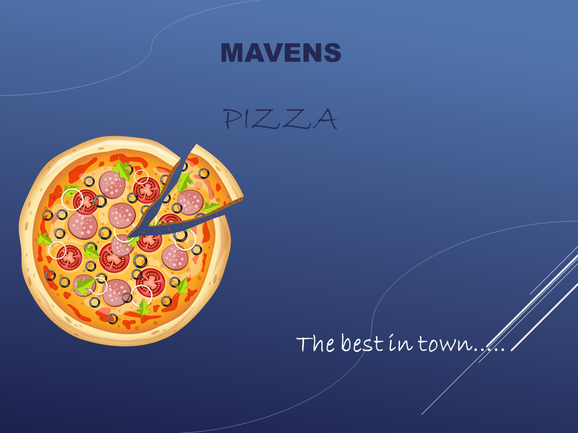
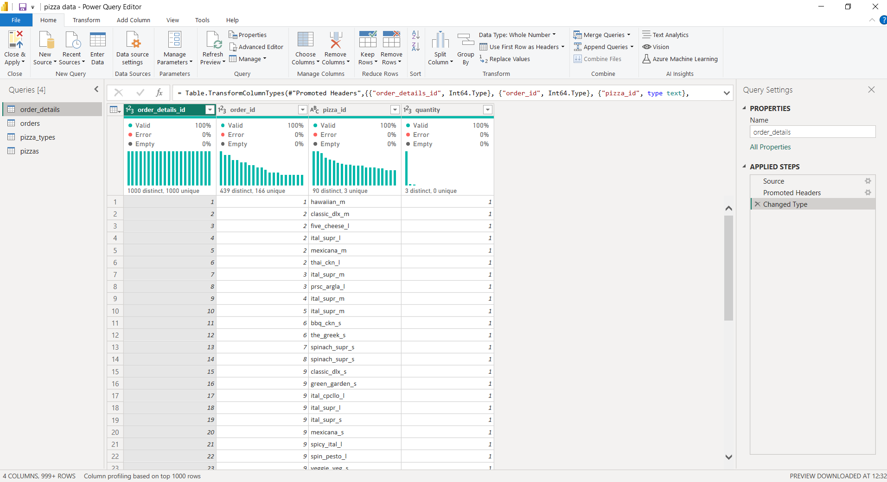
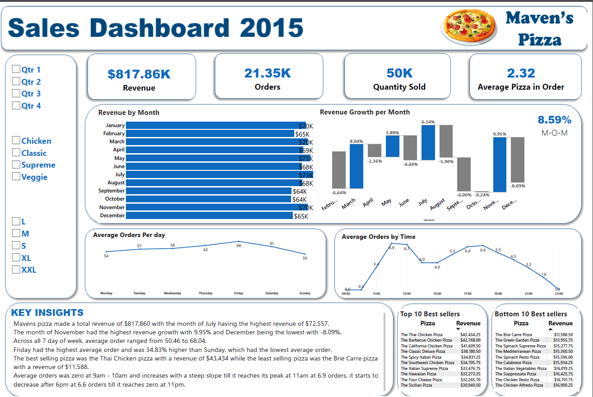

# Mavens Pizza Sales analysis

---

## Introduction
This is a power BI project on sales analysis of a fictitious pizza store named "Mavens Pizza". The project is to analyse and derive insights to answer business questions and help the store make data deiven decisions.I came across this dataset on Mavens [website](https://mavenanalytics.io/data-playground). The dataset contains a year’s worth of sales from a fictitious pizza place.

## Problem Statement
-	How many customers do we have each day? Are there any peak hours?
-	How many pizzas are typically in an order? Do we have any bestsellers?
-	How much money did we make this year? Can we identify any seasonality in the sales?
-	Are there any pizzas we should take of the menu, or any promotions we could leverage?

### Power Bi Concepts applied
 DAX Concepts: calculated column, Quick measures.
 
## Data Sourcing 
After I came across the dataset, the above questions were recommended on maven’s platform. I then downloaded the csv file, and extracted it into power BI for visualization.
It contains 4 tables:
- ORDERS with 21350 rows and 3 columns
- ORDER_DETAILS with 48620 rows and 4 columns
- PIZZAS with 96 rows 4 columns
- PIZZA_TYPES with 33 rows 4 columns

---

## Data Transformation
The dataset was already clean and was transformed with the Power query Editor of Power BI. Some of the applied steps include:
- Making first row as headers in Pizza_types column
- Merging of the 4 tables were together using a Left join and the Orders table as the base table.
- Created a new column for revenue (quantity * price)
- Changed the data type to WHOLE NUMBER

## Data Modelling
Data modelling was not needed since its just a table.

## Data Analysis and Visuals

---

## Insights
- Mavens pizza made a total revenue of $817,860 with the month of July having the highest revenue of $72,557.
- The month of November had the highest revenue growth with 9.95% and December being the lowest with -8.09%.
- Across all 7 day of week, average order ranged from 50.46 to 68.04.
- Friday had the highest average order and was 34.83% higher than Sunday, which had the lowest average order.
- The best selling pizza was the Thai Chicken pizza with a revenue of $43,434 while the least selling pizza was the Brie Carre pizza with a revenue of $11,588.
- Average orders was zero at 9am - 10am and increases with a steep slope till it reaches its peak at 11am at 6.9 orders, it starts to decrease after 6pm at 6.6 orders till it reaches zero at 11pm.

## Recommendations 
- Capitalize on the best-selling pizza: Since the Thai Chicken pizza is the best-selling pizza, it would be wise for Mavens Pizza to promote this pizza more heavily in their advertising, menu displays and online ordering systems.
- Offer promotions during the slow months: Since November had the highest revenue growth and December had the lowest, Mavens Pizza should consider offering promotions during the slower months to encourage customers to order more frequently.
- Consider adjusting prices: Analyzing revenue data may help Mavens Pizza to determine if their prices are optimized. It may be possible that prices for the Brie Carre pizza, which is the least selling pizza, are too high or uncompetitive. A pricing analysis may help to identify areas where prices could be adjusted to improve sales.
- Utilize social media: Since Friday has the highest average order, Mavens Pizza can use social media platforms to promote their products on Fridays. They could offer special deals for customers who order on Fridays. This could help to increase the order size on Fridays.

